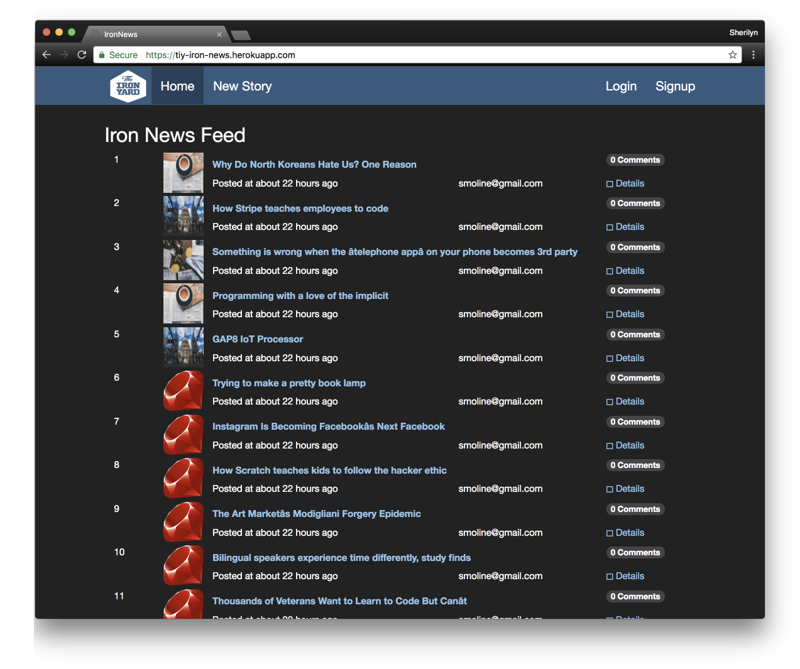

# Iron News

### The purpose of this project is to reimplement the home page of Hacker News but with a Bootstrap / The Iron Yard flare.

* Main Url has a list of stories with the most recently posted story on top
* The index shows the name of the story that is also a link to the story and a timestamp when the story was posted, and the email address of the person who submitted it.
* User may add a story via the New Story link in the navbar
* Used seed.rb to fill in the db with some stories

* Users are not able to submit a story without a link or email address
* Validation verifies that the link starts with "http" or "https"
* Timestamp states how log ago a story was posted

* Added the ability to add comments to a story
* Updated the stories index page to show a comment count

